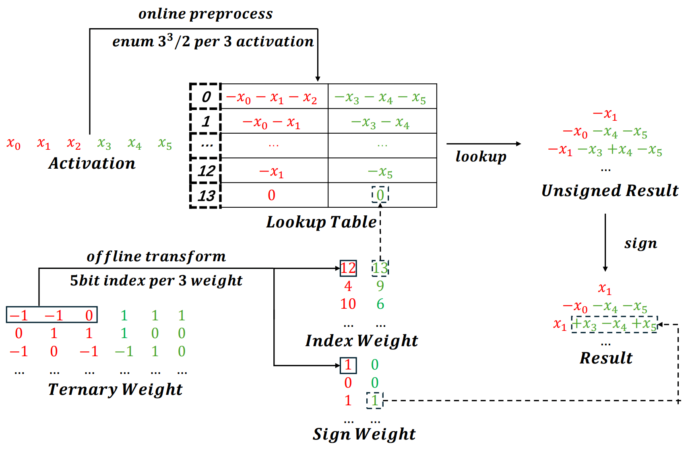

### 👋 Hi, I'm Jinheng Wang

A passionate AI Infra researcher focused on high-performance computing and algorithm–infra co-design.

### 🚀 What I Build

Core developer of:

**[BitNet](https://github.com/microsoft/BitNet)** — official inference framework for 1-bit LLMs.
  - **6.25x** faster than full-precision and **2.32x** faster than low-bit baselines
  - **lossless inference** for BitNet b1.58 via the TL / I2_S ternary mpGEMM kernels
  - measured on edge CPUs: Intel i7-13700H, Apple M2 Ultra

**[TeraMoE](https://github.com/PFCCLab/TeraMoE)** — cross-node expert-parallel MoE training library.
  - **1.30x** speedup over DeepEP + TE in communication-bound sparse-expert regimes, **1.24x** under 3.0x expert load imbalance
  - **28%** less activation memory than Megatron
  - **one cooperative persistent kernel** overlapping dispatch, expert compute and combine
  - measured on SM100 GPUs, EP16–64 over RDMA

### 📄 Research

- [**Bitnet.cpp: Efficient Edge Inference for Ternary LLMs**](https://arxiv.org/abs/2502.11880) — *ACL 2025 Main*, first author
- [**1-bit AI Infra: Part 1.1, Fast and Lossless BitNet b1.58 Inference on CPUs**](https://arxiv.org/abs/2410.16144) — first author

### 🔧 Also Contributing To

[llama.cpp](https://github.com/ggml-org/llama.cpp) · [Paddle](https://github.com/PaddlePaddle/Paddle) · [TensorRT-LLM](https://github.com/NVIDIA/TensorRT-LLM)

### 🏆 GitHub Trophies

